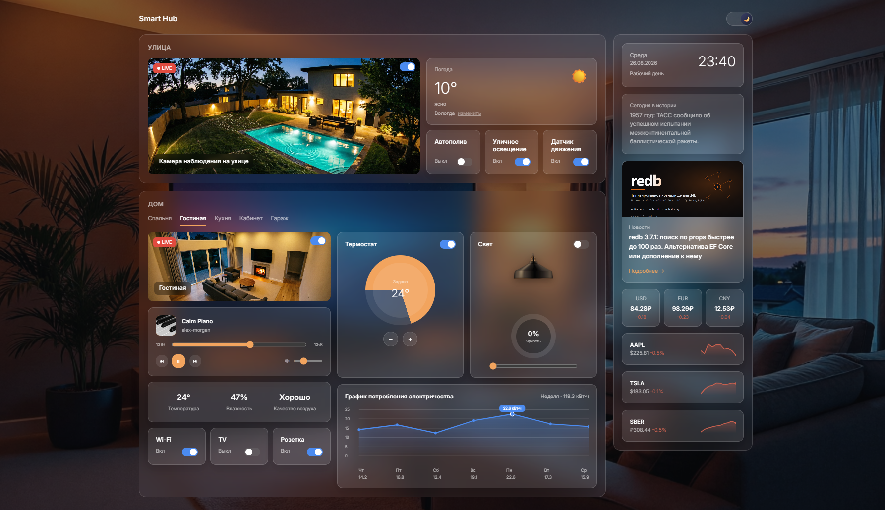

# Smart Hub

<div align=center>




</div>

---

**Smart Hub** — это интерактивная панель мониторинга и управления умным домом:
комнаты, устройства, музыка, датчики, погода, курсы валют и новости — всё в одном
аккуратном, живом интерфейсе с плавной сменой дня и ночи.

## ✨ Возможности

- 🏘️ **Комнаты** — Спальня, Гостиная, Кухня, Кабинет, Гараж и отдельная секция
  «Улица»; переключение между ними — по вкладкам
- 📷 **Камеры видеонаблюдения** в каждой комнате и на улице с live-индикатором
- 💡 **Умный свет** с плавной регулировкой яркости
- 🌡️ **Термостат** с целевой/текущей температурой и автоматическими режимами
  нагрева, охлаждения и ожидания (HEAT / COOL / IDLE)
- 🔌 **Тумблеры устройств** — Wi-Fi, TV, розетка, автополив, уличное освещение,
  датчик движения
- 📊 **Датчики** температуры, влажности и качества воздуха с живой, плавно
  меняющейся динамикой показаний
- 🚨 **Уведомления** — всплывающие алерты по показаниям датчиков
- 🎵 **Музыкальный плеер** с реальными треками, прогресс-баром и переключением
  композиций
- ⚡ **График энергопотребления** за последние 7 дней
- ☀️ **Погода** — определяется по названию города через геокодинг
- 💱 **Курсы валют** USD / EUR / CNY
- 📰 **Лента новостей** (Habr / Lenta)
- 📅 **Факт «сегодня в истории»** и статус дня — рабочий, выходной или
  праздничный
- 📈 **Котировки акций** с изменением в процентах
- 🌗 **Тёмная и светлая тема** — фон комнаты и улицы плавно переключается
  день ⇄ ночь, выбор темы запоминается между визитами
- 💾 Состояние тумблеров и темы сохраняется в `localStorage` — обновление
  страницы ничего не сбрасывает
- 📱 Аккуратный, отзывчивый интерфейс на Tailwind CSS

## 🛠️ Технологии

| Слой        | Инструменты                         |
| ----------- | ----------------------------------- |
| UI          | React 18 + TypeScript, Tailwind CSS |
| Состояние   | Zustand                             |
| Сборка      | Vite                                |
| HTTP-клиент | Axios                               |
| Тесты       | Jest + React Testing Library        |

Приложение работает как самостоятельное клиентское SPA: локальная симуляция
датчиков, музыки и котировок происходит прямо в браузере, а данные о погоде,
курсах валют, новостях и статусе дня приложение получает напрямую с открытых
публичных API (см. таблицу ниже).

## 🚀 Быстрый старт

```bash
npm install
npm run dev
```

Откройте [http://localhost:5173](http://localhost:5173) — дашборд открывается
сразу, без логина и регистрации.

## 📦 Сборка и тесты

```bash
npm run build   # продакшн-сборка в dist/
npm run preview # локальный просмотр собранной версии
npm run test    # юнит-тесты (Jest + React Testing Library)
npm run lint    # ESLint
```

## 🗂️ Структура проекта

```
src/
├── api/external.ts         # запросы к внешним API (погода, курсы, новости…)
├── data/seedData.ts        # стартовые данные комнат, устройств, музыки, акций
├── hooks/useSimulation.ts  # живая симуляция датчиков, музыки и котировок
├── store/                  # Zustand-сторы: devices, sensors, music, stocks, theme
├── components/             # UI-компоненты: карточки, вкладки, графики
├── pages/DashboardPage.tsx # главный экран приложения
└── utils/                  # вспомогательные утилиты

public/
├── images/                 # изображения комнат, устройств, обложки треков
├── audio/                  # аудиотреки для музыкального плеера
└── fonts/                  # шрифты интерфейса
```

## 🌐 Внешние источники данных

Каждый источник ниже поддерживает CORS, не требует API-ключа и вызывается
напрямую из браузера с fallback-цепочкой на случай сбоя основного провайдера:

| Функция                  | Основной источник                                | Резервный источник            | Если оба недоступны               |
| ------------------------ | ------------------------------------------------ | ----------------------------- | --------------------------------- |
| Погода                   | Open-Meteo (+ их же geocoding для поиска города) | —                             | сообщение об ошибке в карточке    |
| Курсы валют              | cbr-xml-daily.ru (зеркало ЦБ РФ)                 | currency-api (fawazahmed0)    | сообщение об ошибке               |
| Статус дня               | isdayoff.ru (для РФ)                             | Nager.Date (для других стран) | локальный fallback «Рабочий день» |
| Факт «сегодня в истории» | Wikipedia REST (on this day)                     | —                             | локальный fallback-текст          |
| Новости                  | Habr RSS                                         | Lenta RSS                     | пустая лента                      |

Комнаты, устройства, музыка, датчики, котировки и график энергии — не внешние
API, а локальные данные (`src/data/seedData.ts`), которые «оживляются» через
`useSimulation` (плавное изменение показаний датчиков и котировок,
воспроизведение музыки) — реалистичная симуляция умного дома без физического
оборудования.

## 🎨 Медиа

Изображения и аудио лежат в `public/` и раздаются как есть — обращаться к ним
в коде нужно по абсолютному пути (например, `/images/day-living-room.png`).
Чтобы заменить картинку комнаты, устройства или обложку трека, просто
положите свой файл в `public/images/` под тем же именем или обновите путь в
`src/data/seedData.ts`.

## ☁️ Деплой

Результат `npm run build` — обычный статический сайт (`dist/`), который можно
разместить на любом бесплатном статическом хостинге:

- **Vercel** / **Netlify** — Import Project → Build command `npm run build` →
  Output directory `dist`
- **GitHub Pages** — `npm run build`, запушить содержимое `dist/` в ветку
  `gh-pages`
- **Cloudflare Pages** — аналогично Vercel/Netlify

Переменные окружения для деплоя не требуются — все внешние API вызываются
напрямую из браузера пользователя.
